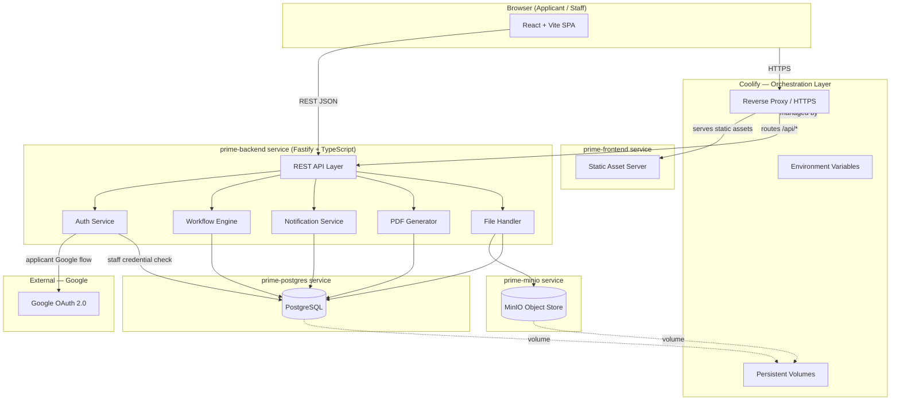

# PRIME v2 — System Architecture

| Field | Value |
|---|---|
| Document | PRIME v2 System Architecture |
| Version | 1.0 |
| Status | DRAFT — pending Phase 4 approval gate |
| Phase | Phase 4 — Architecture and Data Design |
| Author | Architect Agent |
| Date | 2026-07-01 |

---

## Approval

| Approver | Role | Status |
|---|---|---|
| [TBC] | Product Owner | Pending — architecture impact |
| [TBC] | Architect | Pending — technical design |
| [TBC] | Security Agent | Pending — security design |
| [TBC] | DevOps Agent | Pending — deployment design |

> **Gate rule:** Coding (Phase 6) must not begin until all four approvers above have signed off.

---

## 1. Logical Architecture Diagram



---

## 2. Component List

| Component | Technology | Role |
|---|---|---|
| React SPA | React 18 + Vite + TypeScript | Browser-rendered UI — forms, dashboards, notifications, proposal views |
| Fastify API | Fastify + TypeScript | REST API server — all business logic, auth, workflow, file handling |
| PostgreSQL | PostgreSQL 16 | Primary data store — proposals, users, roles, comments, audit logs, versioning, notifications |
| MinIO | MinIO (S3-compatible) | Object storage — proposal attachments; never accessed directly from browser |
| Coolify | Coolify + Docker Compose | Orchestration — HTTPS termination, env vars, health checks, volumes, restart policies |

### Supporting Libraries (subject to Security Agent review before adoption)

| Purpose | Candidates |
|---|---|
| ORM / query builder | Prisma or Drizzle ORM |
| Input validation | Zod |
| Frontend form management | React Hook Form |
| Frontend data fetching | TanStack Query |
| Google OAuth | `@fastify/oauth2` with Google provider |
| PDF generation | Puppeteer (headless Chrome) or PDFKit |
| Background jobs | Fastify plugin + pg-boss, or inline async handlers |

> No supporting library is final until the Architect and Security Agent approve it.

---

## 3. AppShell and Right-Side Navigation

All authenticated pages share a single layout shell. This applies equally to every role: Applicant, Project Focal, RTEC Member, RTEC Head, Budget Officer, Accountant, Regional Director, and System Administrator.

### Layout

```text
┌─────────────────────────────────────────┬──────────────┐
│                                         │              │
│   Main content area                     │  RightNav    │
│   (dashboard / form / proposal view /   │  (role-based │
│    comment panel / version comparison)  │   menu)      │
│                                         │              │
│                                         │  User menu   │
│                                         │  Logout      │
└─────────────────────────────────────────┴──────────────┘
```

**Rule:** Primary navigation lives on the right edge of the viewport. The left/center area is always the main content. No duplicate horizontal top menu that repeats right-nav links.

### Shared Shell Components

| Component | Responsibility |
|---|---|
| `AppShell` | Page frame — content slot (left) + nav slot (right) |
| `RightNav` | Role-filtered links, user identity, logout |
| `RightNavDrawer` | Mobile/tablet overlay — slides in from the right |
| `PageHeader` | In-content breadcrumbs and page title — not primary nav |

### Responsive Behavior

| Breakpoint | Width | Right Nav Behavior |
|---|---|---|
| Mobile | < 768px | Collapsed by default; menu button opens `RightNavDrawer` sliding from right |
| Tablet | 768px – 1023px | Icon rail or narrow panel on the right; labels expand on tap or hover |
| Desktop | ≥ 1024px | Full right sidebar — icons + labels always visible |

Minimum touch target: 44px height on mobile and tablet.

### Public Pages

Public and unauthenticated pages (landing page, applicant login, staff login, privacy consent) use a minimal header. The `AppShell` with `RightNav` is rendered only after successful authentication.

### Role-Based Menu Items

Same shell, different links per role. Examples:

| Role | Typical Right Nav Items |
|---|---|
| Applicant | My Proposals, New Proposal, Notifications, Profile |
| Project Focal | My Queue, All Assigned Proposals, Notifications |
| RTEC Member | RTEC Queue, My Reviews, Notifications |
| RTEC Head | RTEC Queue, Consolidation, Notifications |
| Budget Officer | Budget Queue, Notifications |
| Accountant | Accounting Queue, Notifications |
| Regional Director | For Decision, All Proposals, Notifications |
| System Administrator | Users, Roles, Proposal Types, Forms, Workflow Config, Audit Logs, System |

---

## 4. Request Flow

```text
Browser
  │
  │ HTTPS request
  ▼
Coolify Reverse Proxy (HTTPS termination, Let's Encrypt cert)
  │
  ├── Static asset request (JS, CSS, HTML)
  │     ▼
  │   prime-frontend (Vite build served as static files)
  │     ▼
  │   React SPA rendered in browser
  │
  └── API request  /api/*
        ▼
      prime-backend (Fastify)
        │
        ├── Route handler + Zod validation
        ├── Auth middleware (verify session/JWT, check role)
        ├── Business logic / workflow engine
        │
        ├── Database query → PostgreSQL (via ORM)
        │
        └── File operation → MinIO SDK
              (presigned URL returned to client, or stream proxied)
```

**Key rules:**
- All inter-service communication is on the internal Docker network — never public.
- PostgreSQL and MinIO are not reachable from outside the Docker network.
- The frontend SPA communicates with the backend only via the `/api/*` path through the reverse proxy.
- MinIO admin credentials are never exposed to the browser.

---

## 5. Authentication Flow

Two authentication paths exist. They are **strictly separate** and must not share session creation logic.

### 5.1 Applicant Path — Google OAuth 2.0

```text
Browser (Applicant)
  │
  │ Clicks "Sign in with Google" on applicant login page
  ▼
GET /auth/google  →  Fastify redirects to Google OAuth consent
  │
  │ Google callback
  ▼
GET /auth/google/callback  →  Fastify receives authorization code
  │
  ├── Exchange code for Google profile (email, name, Google ID)
  ├── Look up user by Google ID in `users` table
  │     ├── Not found → create new user with role = APPLICANT
  │     └── Found → update last login
  ├── Reject if user has a staff role (APPLICANT-only path)
  ├── Create session / issue JWT
  │
  ▼
Redirect to applicant dashboard
  │
  ├── First login? → Show privacy consent screen (AUTH-11)
  │     Applicant must accept before accessing any proposal feature
  └── Returning login → Direct to dashboard
```

### 5.2 Staff Path — Email and Password

```text
Browser (Staff)
  │
  │ Submits email + password on staff login page
  ▼
POST /auth/staff/login
  ├── Look up user by email in `users` table
  ├── Reject if user has APPLICANT role (staff-only path)
  ├── Reject if account is deactivated
  ├── Verify bcrypt password hash
  ├── Rate-limit failed attempts
  ├── Create session / issue JWT with role(s)
  │
  ▼
First login?
  ├── Yes → Force password change before any other action
  └── No  → Redirect to role-appropriate dashboard
```

### 5.3 Separation Guarantees

| Rule | Enforcement |
|---|---|
| Staff cannot use Google login | `/auth/google/callback` rejects any account with a staff role |
| Applicants cannot use staff login | `POST /auth/staff/login` rejects APPLICANT-role accounts |
| Google login page and staff login page are separate routes and separate UI screens | Enforced by routing and middleware |
| Every auth action is logged in `audit_logs` | Enforced in auth service |

---

## 6. Notification Flow (In-App Only — MVP)

> Email notifications via SMTP are explicitly **out of scope for the MVP** (OOS-15). Confirmed by supervisor 2026-07-01. See `docs/requirements/PRIME-v2-MVP.md` §4.

```text
Workflow transition occurs (e.g., Focal endorses to RTEC)
  │
  ▼
Fastify Workflow Engine writes one or more notification records
  to `notifications` table in PostgreSQL
  (recipient_user_id, proposal_id, event_type, message, read=false, created_at)
  │
  ▼
React frontend (authenticated user's session)
  │
  ├── Polling or Server-Sent Events (SSE) from /api/notifications/stream
  ├── Unread count badge on RightNav notification icon
  └── Notification list panel (mark as read, link to proposal)
```

**Notification triggers (minimum for MVP):**
- Proposal submitted (Focal notified)
- Proposal returned to Applicant (Applicant notified)
- Proposal endorsed to RTEC (RTEC members notified)
- RTEC result returned to Focal (Focal notified)
- Proposal endorsed to Budget (Budget Officer notified)
- Proposal endorsed to Accounting (Accountant notified)
- Proposal endorsed to RD (RD notified)
- RD final decision (Applicant and Focal notified)

---

## 7. File Storage Flow

### Upload

```text
Applicant selects file in React form
  │
  ▼
POST /api/attachments  (multipart/form-data)
  │
  ├── Fastify validates:
  │     - File type (allowed list only — e.g., PDF, DOCX, XLSX, JPG, PNG)
  │     - File size (maximum enforced)
  │     - Authenticated + authorized user
  │
  ├── Stream file to MinIO bucket
  │     - Object key: {proposalId}/{versionId}/{uuid}.{ext}
  │     - No executable extensions allowed
  │
  ├── Write record to `proposal_attachments` table:
  │     (proposal_id, version_id, minio_key, filename, content_type, size_bytes, uploaded_by)
  │
  └── Return attachment ID + metadata to React
```

### Download

```text
Authorized user requests attachment
  │
  ▼
GET /api/attachments/:id
  │
  ├── Fastify verifies: user is authenticated + has permission for this proposal
  │
  ├── Option A: Generate MinIO presigned URL (short TTL) → return to React → browser fetches directly
  └── Option B: Fastify proxies stream from MinIO → sends to browser
      (Option chosen based on security review — presigned URL preferred for performance)
```

**Security rules:**
- MinIO admin credentials are environment variables on the backend only.
- Browser never sends requests directly to MinIO.
- Object keys are UUIDs — not guessable from filename.
- Attachment access is always permission-checked in Fastify before any URL or stream is issued.

---

## 8. PDF Generation Flow

```text
Authorized user requests PDF export
  │
  ▼
POST /api/proposals/:id/export/pdf
  │
  ├── Fastify verifies: user is authorized to export this proposal
  │
  ├── Fetch proposal version snapshot from PostgreSQL
  │     (all field values, comments, workflow history, attachment metadata)
  │
  ├── Render to PDF using server-side library:
  │     - Candidate: Puppeteer (renders HTML template to PDF)
  │     - Candidate: PDFKit (programmatic layout)
  │     - Final choice recorded in a separate ADR (ADR-002, pending)
  │
  ├── PDF output options:
  │     - Stream directly to browser (Content-Disposition: attachment)
  │     - Or store in MinIO temporarily + return presigned download URL
  │
  └── Log export action in `audit_logs`
       (user_id, proposal_id, version_id, action=PDF_EXPORT, timestamp)
```

**Rules:**
- Unauthorized users (e.g., RTEC Member requesting another member's private review PDF) must be blocked.
- Generated PDF content must exactly match the stored proposal version — no live recalculation of submitted data.
- Private RTEC member comments must not appear in the Applicant-facing PDF.

---

## 9. Deployment Architecture on Coolify

> Decision to use separate services (Option A) is formally recorded in `docs/architecture/ADR-001-deployment-container-strategy.md`.

### Service Map

```text
Coolify Project: PRIME v2
│
├── prime-frontend
│     Image: Node/nginx serving Vite build output
│     Exposed: Yes (via Coolify reverse proxy → domain)
│     Port: 80 (internal) → HTTPS (external)
│     Health check: GET / → 200
│
├── prime-backend
│     Image: Node 20 + Fastify app
│     Exposed: Yes (via Coolify reverse proxy → domain/api/*)
│     Port: 3000 (internal) → HTTPS (external, path-based routing)
│     Health check: GET /health → 200
│     Env vars: DB_URL, MINIO_ENDPOINT, MINIO_ACCESS_KEY, MINIO_SECRET_KEY,
│               GOOGLE_CLIENT_ID, GOOGLE_CLIENT_SECRET,
│               SESSION_SECRET, FRONTEND_URL, API_URL
│
├── prime-postgres
│     Image: postgres:16
│     Exposed: No (internal Docker network only)
│     Port: 5432 (internal)
│     Persistent volume: /var/lib/postgresql/data
│     Health check: pg_isready
│
└── prime-minio
      Image: minio/minio
      Exposed: No (internal Docker network only)
      Port: 9000 API, 9001 console (console can be optionally restricted)
      Persistent volume: /data
      Health check: curl /minio/health/live
```

### Network Topology

```text
Internet
    │
    ▼  HTTPS only
Coolify Reverse Proxy (Traefik or Caddy)
    │
    ├── *.domain.tld → prime-frontend (static assets)
    └── *.domain.tld/api/* → prime-backend (REST API)

Internal Docker Network (not reachable from internet)
    prime-backend ──────► prime-postgres :5432
    prime-backend ──────► prime-minio    :9000
```

### Environment Separation

Each environment (local dev, staging, production) has its own:
- PostgreSQL database instance
- MinIO bucket or instance
- Google OAuth client credentials
- Session secret
- Domain
- Coolify project or namespace

No production secrets are committed to Git. `.env.example` documents all required keys with placeholder values.

### Backup

| Service | Backup Method | Frequency |
|---|---|---|
| PostgreSQL | `pg_dump` + upload to secure storage | Daily (automated), weekly retention |
| MinIO | MinIO `mc mirror` or volume snapshot | Daily |
| Configuration | Coolify export + env inventory (no real secrets) | On each deployment |

Restore procedures must be tested before production go-live (INFRA-04).

---

## 10. Data Flow Summary

```text
Applicant submits proposal
  → React sends form data via POST /api/proposals
  → Fastify validates + saves to PostgreSQL (proposals + proposal_versions tables)
  → Attachments streamed to MinIO, keys recorded in proposal_attachments
  → Workflow Engine transitions status → SUBMITTED_TO_FOCAL
  → Notification written to notifications table (Focal notified)
  → Audit log entry written

Project Focal endorses to RTEC
  → POST /api/proposals/:id/workflow/endorse-to-rtec
  → Fastify verifies Focal role + proposal ownership
  → Workflow Engine validates transition (UNDER_FOCAL_REVIEW → ENDORSED_TO_RTEC)
  → Status updated in PostgreSQL
  → Notifications written for all assigned RTEC members
  → Audit log entry written

RD approves
  → POST /api/proposals/:id/workflow/approve
  → Fastify verifies RD role
  → Status → APPROVED (terminal)
  → Notifications written (Applicant, Focal)
  → Audit log entry written
  → Proposal record locked (no further edits)
```

---

## 11. Security Architecture Summary

| Area | Control |
|---|---|
| Transport | HTTPS only — enforced by Coolify reverse proxy |
| Authentication | Separate Google OAuth (applicants) and bcrypt email/password (staff) |
| Authorization | Role-based — every Fastify route checks permission before action |
| Session | JWT or server session with expiry; invalidated on deactivation |
| File uploads | Type + size validation in Fastify; no executables; UUIDs as object keys |
| File access | Permission check before presigned URL or proxy stream |
| Secrets | Environment variables only; never in source code or Git |
| Database | PostgreSQL not exposed outside Docker network |
| MinIO | Not exposed outside Docker network; admin creds in backend env only |
| Audit | Append-only audit_logs table; every transition, login, and export logged |
| Rate limiting | Login endpoints rate-limited in Fastify |
| Input validation | Zod schemas on all API inputs |

Full threat model and security controls are documented in `docs/security/PRIME-v2-Security-Plan.md` (Phase 4 deliverable).

---

## 12. References

| Document | Location |
|---|---|
| README — Tech Stack | `README.md §19` |
| README — Architecture Direction | `README.md §20` |
| UI Design Standards | `docs/frontend/UI-DESIGN-STANDARDS.md` |
| MVP Specification | `docs/requirements/PRIME-v2-MVP.md` |
| Roles and Permissions | `docs/requirements/PRIME-v2-Roles-and-Permissions.md` |
| Workflow and Statuses | `docs/workflows/PRIME-v2-Workflow.md` |
| Deployment Strategy ADR | `docs/architecture/ADR-001-deployment-container-strategy.md` |

---

## 13. Revision History

| Version | Summary | Author | Date |
|---|---|---|---|
| 1.0 | Initial architecture document — Phase 4 | Architect Agent | 2026-07-01 |
